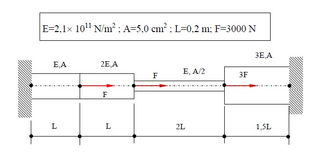

# FINITE ELEMENT METHOD Python
My finite element method solver for bars subjected to axial loads. 
## Using the solver
For using the solver, just clone the master repository and put the [FEM_Bar_element.py](https://github.com/iagolemos1/FINITE_ELEMENT_METHOD_Python/blob/master/FEM_Bar_element.py) file in the folder that you are going to make the analysis. 

## Example
Let's consider the following problem:

The file [bar1_example.py](https://github.com/iagolemos1/FINITE_ELEMENT_METHOD_Python/blob/master/bar1_example.py) on how to use the solver for runing the calculations for the defined model. 
